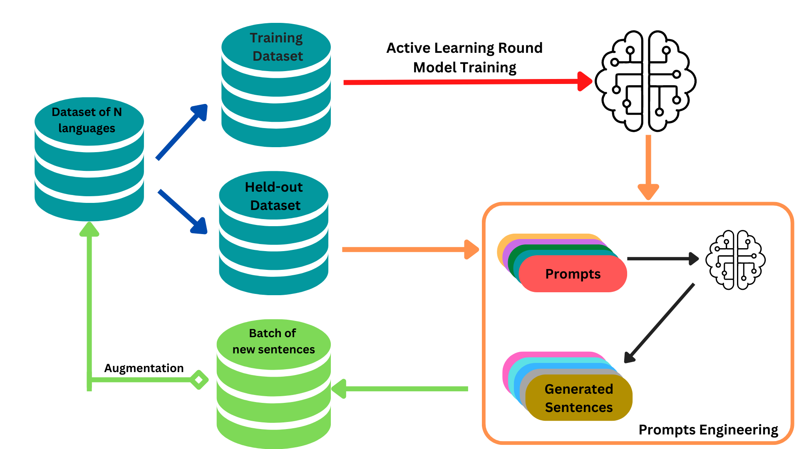

# AfroLM: A Self-Active Learning-based Multilingual Pretrained Language Model for 23 African Languages

This repository contains the code for our paper [`AfroLM: A Self-Active Learning-based Multilingual Pretrained Language Model for 23 African Languages`](https://arxiv.org/pdf/2211.03263.pdf) which will appear at the third Simple and Efficient Natural Language Processing, at EMNLP 2022.

## Our self-active learning framework


## Languages Covered
AfroLM has been pretrained from scratch on 23 African Languages: Amharic, Afan Oromo, Bambara, Ghomalá, Éwé, Fon, Hausa, Ìgbò, Kinyarwanda, Lingala, Luganda, Luo, Mooré, Chewa, Naija, Shona, Swahili, Setswana, Twi, Wolof, Xhosa, Yorùbá, and Zulu.

## Evaluation Results
AfroLM was evaluated on MasakhaNER1.0 (10 African Languages) and MasakhaNER2.0 (21 African Languages) datasets; on text classification and sentiment analysis. AfroLM outperformed AfriBERTa, mBERT, and XLMR-base, and was very competitive with AfroXLMR. AfroLM is also very data efficient because it was pretrained on a dataset 14x+ smaller than its competitors' datasets. Below are the average F1-score performance of various models, across various datasets. Please consult our paper for more language-level performance.

Model | MasakhaNER | MasakhaNER2.0* | Text Classification (Yoruba/Hausa) | Sentiment Analysis (YOSM) | OOD Sentiment Analysis (Twitter -> YOSM) |
|:---: |:---: |:---: | :---: |:---: | :---: |
`AfroLM-Large` | **80.13** | **83.26** | **82.90/91.00** | **85.40** | **68.70** |
`AfriBERTa` | 79.10 | 81.31 | 83.22/90.86 | 82.70 | 65.90 |
`mBERT` | 71.55 | 80.68 | --- | --- | --- |
`XLMR-base` | 79.16 | 83.09 | --- | --- | --- |
`AfroXLMR-base` | `81.90` | `84.55` | --- | --- | --- |

- (*) The evaluation was made on the 11 additional languages of the dataset.
- Bold numbers represent the performance of the model with the **smallest pretrained data**.
## Pretrained Models and Dataset

**Models:**: [AfroLM-Large](https://huggingface.co/bonadossou/afrolm_active_learning) and **Dataset**: [AfroLM Dataset](https://huggingface.co/datasets/bonadossou/afrolm_active_learning_dataset)

## HuggingFace usage of AfroLM-large
```python
from transformers import AutoTokenizer, AutoModelForTokenClassification
model = AutoModelForTokenClassification.from_pretrained("bonadossou/afrolm_active_learning")
tokenizer = AutoTokenizer.from_pretrained("bonadossou/afrolm_active_learning")
tokenizer.model_max_length = 256
```

## Reproducing our result: Training and Evaluation

- To train the network, run `python active_learning.py`. You can also wrap it around a `bash` script.
- For the evaluation:
    - NER Classification: `bash ner_experiments.sh`
    - Text Classification & Sentiment Analysis: `bash text_classification_all.sh`
    

## Citation
 - **Arxiv Citation**:
 
 ``@misc{dossou2022afrolm,
      title={AfroLM: A Self-Active Learning-based Multilingual Pretrained Language Model for 23 African Languages}, 
      author={Bonaventure F. P. Dossou and Atnafu Lambebo Tonja and Oreen Yousuf and Salomey Osei and Abigail Oppong and Iyanuoluwa Shode and Oluwabusayo Olufunke Awoyomi and Chris Chinenye Emezue},
      year={2022},
      eprint={2211.03263},
      archivePrefix={arXiv},
      primaryClass={cs.CL}}``

We will share the official proceeding citation as soon as possible. Stay tuned, and if you have liked our work, give it a star.
## Reach out

Do you have a question? Please create an issue and we will reach out as soon as possible